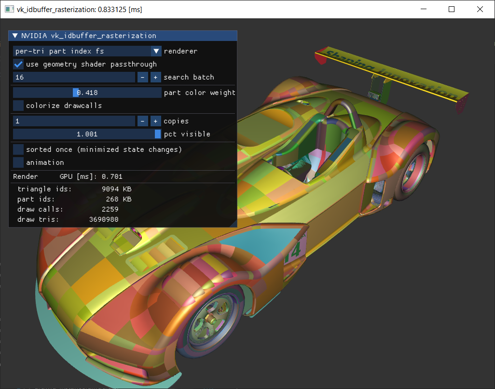

# vk_idbuffer_rasterization

In CAD rendering a surface is often created of multiple feature parts, for example from nurbs-surfaces joined together create the solid shape.
When rendering an object with material effects, we normally ignore such parts and attempt to render the shape as a whole. However, under some
circumstances we might want to have the ability to identify each part uniquely (see the individually-tinted parts in the screenshot).



(CAD model courtesy of PTC)

In this sample we leverage the unique part ids to implement a very basic mouse selection highlight (animated inverted color effect over the part).
Another use-case for idbuffers / item buffers containing unique part IDs is screenspace-based outlining for feature- or silhouette-edges.

One issue we face is that, while an object might have many triangles in whole, when it's made of many such parts, they tend to have few triangles each. Therefore, rendering the parts individually does not allow GPUs to run at full performance, even when we remove the CPU-bottlenecks from such small drawcalls, the GPU can become front-end bound on the GPU, as the front-end is responsible for creating the drawcalls.

A modern GPU tends to be wide, that means it has lots of execution units that prefer big work loads, so a drawcall with just a few triangles (less than 500) tends to not be able to sature the hardware quick enough. While the hardware is able to process multiple drawcalls in parallel, there tend to be limits on how much can run in parallel, and also if the work per-draw is small the setup/overhead of each draw just can bite us in the end.

Sometimes it's not avoidable to have objects with few drawcalls, ideally those get not drawn in bulk, but interleaved with objects that have more triangles so we can hide this problem better.

In this sample we showcase a few rendering techniques to get a per-part ID within the fragment shader and still be efficient.

Typical UI operations:

- `renderer` change between different techniques to render the partIDs
- `use geometry shader passthrough` affects renderers with the `gs` suffix and makes use of the `GL_NV_geometry_shader_passthrough` if supported
- `search batch` the number of parts per drawcall to batch in the `search` renderers.
- `part color weight` slider allows to blend between the individual part colors and the material color
- `colorize drawcalls` when active overrides the object's material color with a per-draw color (useful to show the batching)
- `model copies` increase the number of instances of the model (recommended for fast GPUs and performance investigation)
- `Render GPU [ms]`: milliseconds it took to render the scene, please disable vsync (press V, see window title) for performance investigation and create meaningful loads.


## CAD Model Setup

Some assumptions about how we organized our CAD model / buffers:

* geometry is a set of vertices and indices
* geometry is made of multiple parts, which each take a range of the geometry's triangle indices.
* geometry can be drawn as single drawcall spanning all triangles / all parts.
* one object references a geometry (so we can instance the same geometry for each wheel)
* each object has a `uniquePartOffset` so that a final part that is rendered can be uniquely identified 

## Techniques to draw per-part IDs

We implemented a few different approaches to get a per-part ID in the fragment-shader stage at the end.
Not all of them are as versatile as others. As always with graphics programming, your mileage will vary as
the outcome greatly depends on your typical input data.

### **per-draw part index**

Each drawcall sets the part index. This means if our model has lots of parts, we get a ton of drawcalls.

For CAD parts this often has the **risk of being slowest technique**, but might be the simplest starting point.

The performance outcome of rendering techniques always depends on your data, if your "parts" tend to have plenty triangles,
then this way is totally fine to use.

``` cpp
// drawcall setup
  // We encode the partIndex in the "baseInstance" value of each drawcall.
  // This makes this technique also friendly with multi-draw-indirect structure.
  // We don't really use instancing, so the value will be always be available
  // as-is in the drawcall.
  vkCmdDrawIndexed(cmd, part.indexCount, 1, part.firstIndex, part.firstVertex,
                        part.ID);

// vertex shader simply passes through the partIndex
// in Vulkan gl_InstanceIndex is the result of gl_InstanceID + gl_BaseInstance
  // input
  layout(location=0) in Interpolants {
    ...
    flat uint partIndex;
  } OUT;

  // code
  ...
  OUT.partIndex = gl_InstanceIndex;

// fragment shader picks up the value from the vertex-shader
  // input
  layout(location=0) in Interpolants {
    ...
    flat uint partIndex;
  } IN;

  // code
  ...
  int partIndex = IN.partIndex;

```

### **per-triangle part index**

In this variant we store a `triangle partID buffer` for each triangle of the object's geometry. This maps each triangle to the part it belongs to. Depending on the number of parts we can use `uint8_t`, `uint16_t` or `uint32_t` array. In this example we used `uint32_t` and in the UI you can see the memory cost under `triangle ids`.

While this costs a bit of extra memory, it tends to be the fastest variant, as we can still render the entire object in one shot, independent how many parts it contains, that is why we **recommend this setup**.

``` cpp
// drawcall setup
  // similar as before we hijack the "baseInstance" value to get a cheap per-draw
  // value. This time we store the geometry's buffer offset into the `triangle partID buffer`.
  vkCmdDrawIndexed(cmd, geometry.indexCount, 1, geometry.firstIndex, geometry.firstVertex, 
                        geometry.partIDsOffset);

// fragment shader
  // lookup each triangle's partId
  // "PUSH.partIds" is a pushconstant that contains the buffer_reference address 
  //                for array that contains the partID per triangle.
  // "IN_ID.idsOffset" is used a bit like "firstIndex" in a drawcall, it allows us 
  //                   to store many object's worth of partIDs in the buffer.
  //                   It is piped through the vertex-shader as in the simple setup.
  int partIndex = int(PUSH.partIds.d[gl_PrimitiveID + int(IN_ID.idsOffset)]);

```

The easiest and often fastest option to do this lookup is inside the fragment-shader. The renderers with the `fs` suffix do the lookup there:
- [drawid_primid.frag.glsl](drawid_primid.frag.glsl).

Another alternative is using a geometry-shader and compute a new gl_PrimitiveID passed to the fragment shader. The renderers with the `gs` perform the lookup in the geometry-shader stage:
- [drawid_primid_gs.geo.glsl](drawid_primid_gs.geo.glsl). 

Because our geoemtry-shader is only computing per-triangle values and not changing vertices, we can use the `GL_NV_geometry_shader_passthrough` extension to further accelerate it. You can see the impact of the performance you get by disabling the option in the UI.

Using the geometry-shader version is typically slower than the fragement-shader, and we also do the operation/fetching prior early depth culling. So we don't recommend using the geometry-shader technique either.

### **per-triangle search part index**

In this technqiue we try to lower the memory footprint of the previous technique. Before we had one partID per triangle, but what if we just store how many triangles each part stores and then figure out which part we are. 

This means we only need the number of triangles each part has, which is a lot less memory (see `part ids` in UI), as it no longer depends on the actual number of triangles.

We batch some parts together as single drawcall and then search based on `gl_PrimitiveID`. 

The drawcalls are batched to contain up to `SEARCH_COUNT` many parts and our shader-code is optimized for this.
In our sample a value of 16 worked well.

``` cpp
// drawcall setup
  // We batch our geometry parts into a reduced number of drawcalls.
  // This time we encode some crucial information about the batch in the "baseInstance"
  // "partCount" tells us how many parts are in the batch (up to SEARCH_COUNT many)
  // "partOffset" is the partID of the first part within this batch.
  vkCmdDrawIndexed(cmd, batch.indexCount, 1, batch.firstIndex, batch.firstVertex,
                        batch.partCount | (batch.partOffset << 8));


// fragment shader

  // the batch meta info that we get per-draw
  uint partOffset = IN_ID.idsOffset >> 8;
  uint partCount  = IN_ID.idsOffset & 0xFF;

  int begin = 0;
  int partIndex = 0;

  // unroll support is provided via GL_EXT_control_flow_attributes
  [[unroll]]
  for (int i = 0; i < SEARCH_COUNT; i++)
  {
    // for each part in the batch get number of triangles
    // (we pad our partIds buffer at the end so that this hardcoded search window never
    //  creates out-of-memory access)
    
    // don't make this load part of a dynamic condition, so that the compiler
    // can batch-load all SEARCH_COUNT many loads in separate registers, which reduces
    // memory latency.
    partTriangleCount = int(PUSH.partIds.d[partOffset + i]);

    // we hardcoded this loop in the shader hence we add the `(i < partCount)` condition
    // which is dynamic per batch
    // if the part is valid then look if the current gl_PrimitiveID fits in the range
    [[flatten]]
    if (i < partCount 
      && gl_PrimitiveID >= begin 
      && gl_PrimitiveID < begin + partTriangleCount)
    {
      partIndex = i;
    }
    // shift begin of next range
    begin += partTriangleCount;
  }
```

### Performance

Summarizing our three main techniques:

```
we want to draw a geometry with 9 parts
a b c d e f g h i
```

**per-draw part index**: we get 9 drawcalls, each with one part
```
0 1 2 3 4 5 6 7 8
a b c d e f g h i
```

**per-triangle part index**: we get 1 drawcall, spanning all parts
```
0
abcdefghi
```

**per-triangle search part index**: with this technique and SEARCH_COUNT=4 we get 3 drawcalls
```
0    1    2
abcd efgh i
```

Results for a NVIDIA GeForce 3080 and `model copies = 3` with 1440p + 4x msaa and `search batch = 16`

| renderer                                      | drawcalls | time in milliseconds |
|-----------------------------------------------|-----------|----------------------|
| per-draw part index                           |   296 049 |               12.2   |
| per-triangle part index fs                    |     6 777 |              **2.3** |
| per-triangle part index gs passthrough        |     6 777 |                2.4   |
| per-triangle part index gs                    |     6 777 |                4.3   |
| per-triangle search part index fs             |    22 260 |                2.5   |
| per-triangle search part index gs passthrough |    22 260 |                2.6   |
| per-triangle search part index gs             |    22 260 |                4.6   |

We can see that the per-drawcall part index clearly is the worst option for this model, as it contains of lots of parts with few triangles.
As mentioned before the easiest plug-in solution is typically having a per-triangle buffer.

The passthrough geometry shader variants are relatively close in this sample, but one really shouldn't use a regular geometry shader.

For the single car the `triangle partID buffer` was around 9 MB (32-bit per triangle) and the `partID buffer` used for searches just 268 KB (32-bit per part). So if you are tight on memory the `per-triangle search fs` method may be good choice.

And as reminder evaluate the techniques with your kind of rendering setup and typical content.

## Selection Highlight

The selection highlight is done by figuring out the partIndex underneath the mouse directly in the fragment shader. Using the `atomicMin` instruction provided through `GL_EXT_shader_atomic_int64`, we store the global unique `partIndex` in the lower 32-bit and the fragment depth in the upper 64-bit. At the end of the rendering we will have the closest return in the variable. We copy this variable over and use it for the visual highlight of the next frame. See the following code also in [drawid_shading.glsl](drawid_shading.glsl)


``` cpp
  // simple ray selection highlight:
  
  // if this fragment coordinate matches the mouse cursor
  // we do a 64-bit atomicMin to find the closest surface (lowest depth value)
  // and we store the unique partIndex 
  if (all(equal(ivec2(gl_FragCoord.xy), scene.mousePos))) 
  {
    // pack partIndex in lower  32-bit
    //      depth     in higher 32-bit
    atomicMin(ray.mouseHit, packUint2x32(uvec2(partIndex, floatBitsToUint(gl_FragCoord.z))) );
  }
  
  // rayLast is the result of the above logic from last frame.
  // We cannot use the same frame's result, because as we raster the various triangles
  // the result will change.
  // If the current partIndex matches the one that was the closest in the last
  // frame, then alter the color for the selection highlight.
  // The copying of the result is done after rendering
  // (see the vkCmdCopyBuffer at end of RendererVK::draw)
  if (partIndex == unpackUint2x32(rayLast.mouseHit).x)
  {
    color = mix(color, vec4(1) - color, sin(scene.time * 10) * 0.5 + 0.5);
  }
```

**Tip for VR**

While this sample does a simple ray-test along the mouse cursor, one can use the same principle setup for an arbitrary selection ray. By treating each fragment shader invocation as a small plane we can intersect that with the selection ray. Then test if the intersection point is close to the current gl_FragCoord and if so run the atomicMin above, but with the hit distance rather than depth (means only few fragment shader invocations hit the atomicMin). That would give you a very cheap arbitrary selection ray, say controlled by VR controllers, on any visible surface almost for free. It comes with the restriction that you must have clear vision on anything you want to select, but that is often okay.

## Building
Make sure to have installed the [Vulkan-SDK](http://lunarg.com/vulkan-sdk/). Always use 64-bit build configurations.

Ideally, clone this and other interesting [nvpro-samples](https://github.com/nvpro-samples) repositories into a common subdirectory. You will always need [nvpro_core](https://github.com/nvpro-samples/nvpro_core). The nvpro_core is searched either as a subdirectory of the sample, or one directory up.

If you are interested in multiple samples, you can use [build_all](https://github.com/nvpro-samples/build_all) CMAKE as entry point, it will also give you options to enable/disable individual samples when creating the solutions.
